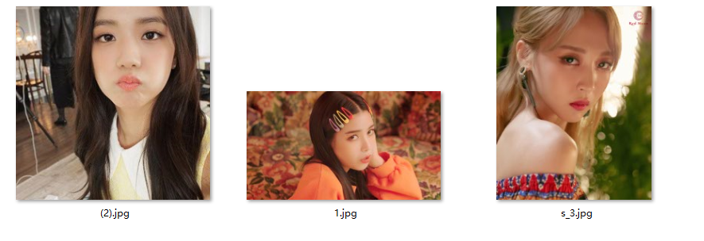
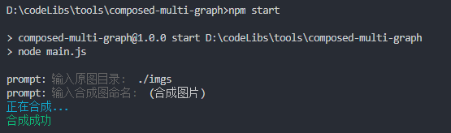

#  composed-multi-graph

基于node.js的多图合成脚本

## 安装
***

```
  npm install
```

> tips: 建议用淘宝源进行依赖安装，npm拉取node-canvas相关依赖时会出现超时失败的情况。


## 使用
***

```
  npm start
```

脚本运行后根据提示填入:
- 图片目录: 必填项，支持绝对地址和相对地址
- 合成图命名：选填项，生成的图片名字


```
  prompt: 输入原图目录:  .\imgs
  prompt: 输入合成图命名:  (合成图片)
```

## 例子
***

1. 原图目录


2. 执行命令


3. 生成图片


